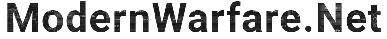

<p align="center">
  
</p>

## 🤔 How To Use

### Creating a request to get **Multiplayer** Stats.

```cs
//Generate a new ModernWarfareClient.
var client = new ModernWarfareClient();

//Provide the user platform as well as the username.
var request  = await client.GetMultiplayerStatsAsync(Platform.BattleNet, "Timmmy#21485");

var kills = request.LifetimeStats.Kills;
var kd = request.LifetimeStats.KDRatio;

var adsKills = request.AccoladesStats.AdsKills;
var c4Kills = request.AccoladesStats.C4Kills;

```

### Creating a request to get **Warzone** Stats.

```cs
//Generate a new ModernWarfareClient.
var client = new ModernWarfareClient();

//Provide the user platform as well as the username.
var request  = await client.GetWarzoneStatsAsync(Platform.BattleNet, "Timmmy#21485");

var kills = request.LifetimeStats.Kills;
var avarageLife = request.LifetimeStats.AvarageLife;

var gamesPlayed = request.BattleRoyalStats.GamesPlayed;
var top5 = request.BattleRoyalStats.Top5;

var cash = request.PlunderStats.Cash;
var contracts = request.PlunderStats.Contracts;

```